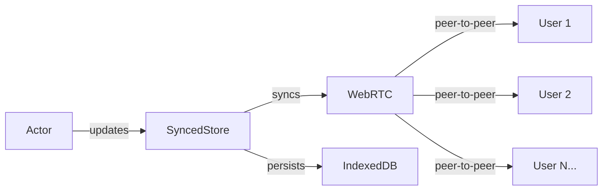

# DomoActors Browser Demo

Trying out actors in the browser via [DomoActors](https://github.com/VaughnVernon/DomoActors) by Vaughn Vernon.

## Architecture

The demo shows two counter implementations: a local actor and a synced actor. The synced version uses SyncedStore (Yjs-based) for real-time synchronization across users via WebRTC, with IndexedDB for local persistence.



Actor methods update the SyncedStore, which automatically syncs changes to all connected users via WebRTC signaling servers and persists state locally in IndexedDB.

**Peer Discovery**: Peers locate each other through public signaling servers. The default server is `wss://y-webrtc-eu.fly.dev` (provided free by the [y-webrtc](https://github.com/yjs/y-webrtc) project). The y-webrtc README also lists additional public servers: `wss://signaling.yjs.dev`, `wss://y-webrtc-signaling-eu.herokuapp.com`, and `wss://y-webrtc-signaling-us.herokuapp.com`. Once discovered, peers establish direct WebRTC connections for peer-to-peer communication. For production deployments, you can run your own signaling server or use a serverless approach (see [Serverless Yjs](https://medium.com/collaborne-engineering/serverless-yjs-72d0a84326a2) for an AWS Lambda/DynamoDB example).

## Setup

```bash
npm install
npm run dev
```

Open http://localhost:8000
